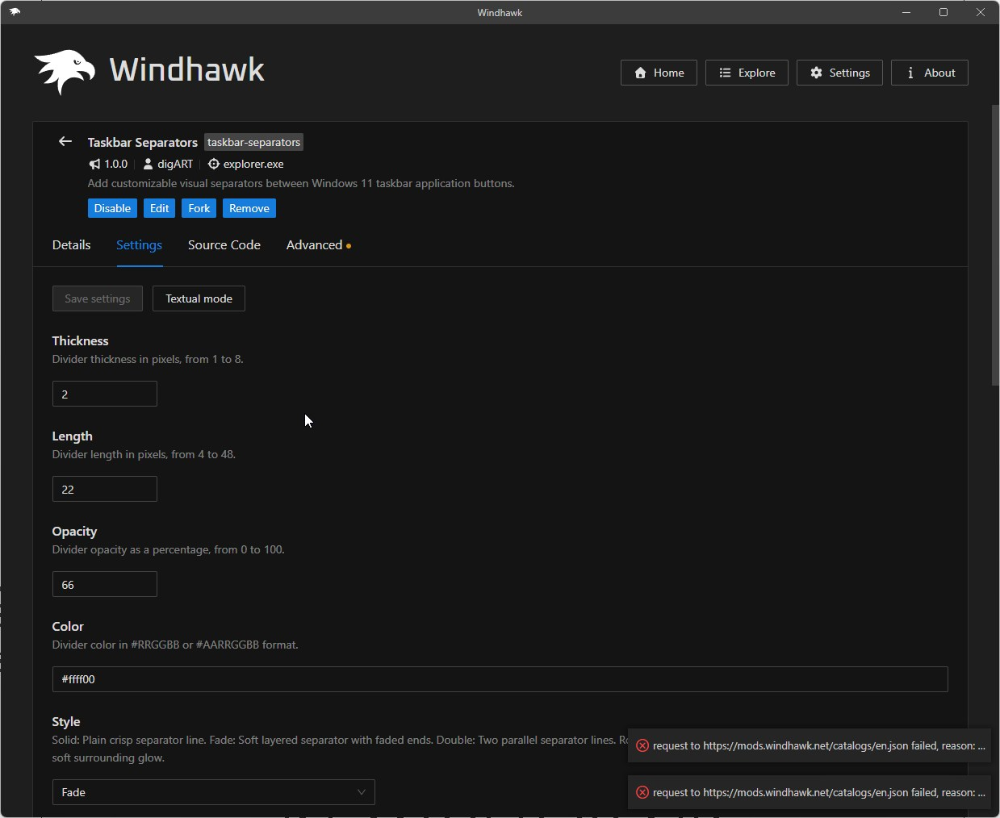
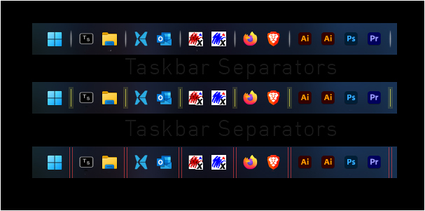

# Taskbar Separators

Add clean, customizable visual separators between application buttons on the Windows 11 taskbar.

Unlike placeholder applications or pinned shortcuts, these separators are visual, non-clickable elements. They do not launch programs or occupy normal application slots.

## Preview

## Features

- Add multiple separators at configurable taskbar positions
- Optional separator before the first application button
- Live position and appearance updates
- Five configurable visual styles:
  - Fade
  - Solid
  - Double
  - Rounded
  - Glow
- Adjustable thickness, length, opacity, color, and effect settings
- Automatic horizontal and vertical taskbar orientation
- Optional animation compatibility mode
- Clean removal when the mod is disabled
- No changes to taskbar button margins, padding, or application behavior

## Position numbering

Numbered positions place separators after application buttons:

- Position `1` places a separator after the first application button
- Position `2` places a separator after the second application button
- Position `3` places a separator after the third application button

Enable **Separator before first app** to place a separator before the first application button.

Start, Search, Widgets, Task View, and other system buttons are not counted as application buttons.

Positions follow the current visual order of taskbar application buttons. Opening, closing, pinning, unpinning, or rearranging applications can change which icons appear beside a configured separator.

## Settings

## Alternate setups

## Installation

### From Windhawk

Once the mod is published in the Windhawk gallery:

1. Open Windhawk.
2. Search for **Taskbar Separators**.
3. Select **Install**.
4. Open the mod settings and configure the separator positions and appearance.

### Manual installation

Until the mod is available in the Windhawk gallery:

1. Install and open Windhawk.
2. Select **Create a new mod**.
3. Replace the generated source with the contents of [`taskbar-separators.wh.cpp`](taskbar-separators.wh.cpp).
4. Compile the mod.
5. Open its settings and configure the separators.

## Animation compatibility

Static taskbars are fully supported.

The mod can follow icons animated by other taskbar mods, but very fast animation may not remain perfectly synchronized because both mods update their visual elements independently.

This affects animation appearance only and does not affect normal static separator positioning.

## Compatibility

- Windows 11 horizontal taskbars
- Vertical taskbars via Vertical Taskbar for Windows 11
- Compatible with Windows 11 Taskbar Styler in normal configurations

The separators are visual overlays. They do not create native taskbar items or reserve additional layout space between application buttons.

## Credits

Taskbar hook and UI-thread infrastructure includes code adapted from Windhawk mods by Michael Maltsev (m417z), including Taskbar Labels for Windows 11.

## License

Copyright © 2026 digART.

Taskbar Separators is licensed under the [GNU General Public License v3.0](LICENSE).